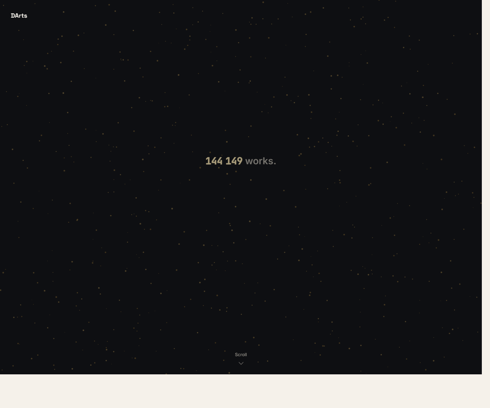

# DArts

**Diversity in the MoMA Collection** is a scroll-driven data story for EPFL COM-480. It follows more than 144,000 cleaned MoMA collection records through medium, geography, gender, time, and a final artist-match quiz.

Live site: https://com-480-data-visualization.github.io/DArts/



## Project Pitch

MoMA is often experienced through a small set of famous paintings and sculptures. The recorded collection tells a different story: paper works dominate the archive, a small group of countries accounts for most credited works, gender parity arrives late and unevenly, and representation varies strongly by medium. DArts turns those patterns into a martini-glass narrative: authored scenes first, an open medium explorer next, and a personal underrepresented-artist match at the end.

## Team

| Student | SCIPER |
| --- | --- |
| Oussama Ghali | 341478 |
| Nour Guermazi | 314474 |
| Isabella Linde | 423106 |

## Tech Stack

- Svelte 5 + Vite
- D3 for scales, layouts, geo projection, and path generation
- TopoJSON for bundled world topology
- Python + pandas for build-time data aggregation
- GitHub Pages deployment through GitHub Actions

## Local Development

```bash
cd website
npm install
npm run dev
```

Production build:

```bash
cd website
npm run lint
npm run build
npm run preview
```

Regenerate data aggregates:

```bash
python data/build_aggregates.py
```

The Vite base path is `/DArts/`, matching the GitHub Pages deployment URL.

## Data

Source: [Museum of Modern Art Collection](https://github.com/MuseumofModernArt/collection), public dataset.

The raw MoMA files are tracked as the `data/moma-collection` submodule. `data/build_aggregates.py` reads the raw CSVs and writes compact JSON files to `website/public/data/`.

Current reconciliation from `data/build_report.txt`:

- Raw artworks: 160,248
- Cleaned artworks used by the site: 144,149
- Dated cleaned artworks after permissive parsing: 141,884
- Cleaned artists: 11,879
- Artist credits: 160,035
- `medium_totals.json` reconciles to 144,149 works

The website never fetches raw CSVs at runtime. It uses pre-aggregated JSON, and the larger `artist_index.json` is loaded only when the explorer expansion or quiz needs it.

## Folder Structure

```text
.
├─ data/
│  ├─ build_aggregates.py
│  ├─ build_report.txt
│  ├─ nationality_to_iso3.json
│  ├─ regions.json
│  └─ moma-collection/
├─ notebooks/
│  └─ exploratory_analysis.ipynb
├─ website/
│  ├─ public/data/
│  ├─ public/topology/world-110m.json
│  ├─ src/App.svelte
│  └─ src/lib/
│     ├─ charts/
│     ├─ components/
│     ├─ design/
│     ├─ scenes/
│     ├─ stores/
│     └─ utils/
└─ .github/workflows/deploy.yml
```

## Narrative Scenes

1. Hero - `DArts`
2. The Collection Takes Shape - treemap of collection areas
3. Where Are These Artists From? - orthographic globe with linked country selection
4. What About Gender? - female-credited share line chart and department small multiples
5. Does Your Medium Matter? - filterable medium explorer with 100% stacked bars
6. Who Are You In The Collection? - deterministic underrepresented artist match
7. Footer - credits, data attribution, and disclaimer

## Deployment

Pushing to `master` or `main` runs `.github/workflows/deploy.yml`.

The workflow installs dependencies with Node 20, runs lint, builds `website/dist`, and publishes it to the `gh-pages` branch with `peaceiris/actions-gh-pages@v4`.

## Notes

This project analyzes the recorded MoMA collection metadata. Demographic fields are limited to what MoMA records; absence in the data is not a judgment of curatorial intent or of an artist's significance.
